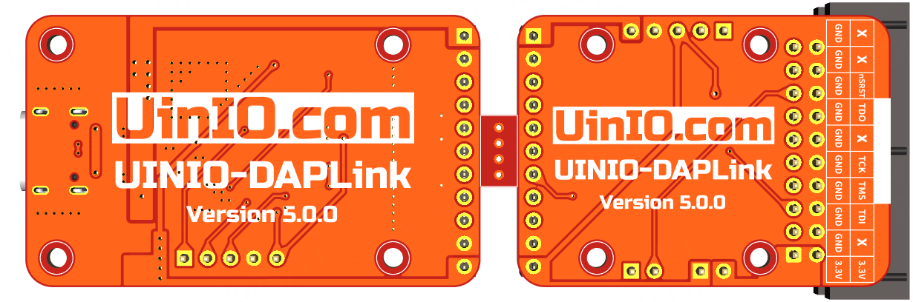

# UINIO-DAPLink 下载调试器

[**UINIO-DAPLink**](https://gitee.com/uinika/UINIO-DAPLink) 是一款基于 [**ARM DAP Link**](https://daplink.io/) 开源固件的硬件下载调试电路设计，采用 `LQFP48` 封装的 **STM32F103CBT6** 或者 **STM32F103C8T6** 微控制器作为主控芯片，同时也兼容其它 `Pin to Pin` 的 **Cortex-M3** 微控制器（需要自行编译固件）。

## 设计概要

1. 清晰合理的丝印标识，并且预留有 `2mm` 直径的固定螺丝孔；
2. **USB Type-C** 接口位置新增一组 TVS 瞬态电压抑制二极管；
3. 对 `5V` 和 `3.3V` 电源采用了大面积铺铜处理，以提升载流能力。
4. 附带有 **SWD** 和 **JTAG** 协议的转接板，以及相关功能的跳线位；
5. 低压差线性稳压器 **LDO** 调整为南京微盟电子的 `ME6211C33M5G` 方案；
6. 专门为 `5V` 引脚接口添加了一组由保险丝和二极管组成的防反接电路；
7. 工程的 `Firmware` 目录已经编译好 [ARMmbed DAPLink](https://github.com/ARMmbed/mbed-HDK-Eagle-Projects) 提供的 [REL v0258](https://github.com/ARMmbed/DAPLink/releases/tag/v0258) 版本固件（包含 `Bootloader` 和 `Interface` 两个二进制文件）；

## 参考技术文档

[UinIO.com 电子技术实验室](http://uinio.com/) 为 **UINIO-DAP-Link** 开源项目提供了如下一系列技术参考资料：

- [《UINIO-DAPLink 核心板原理图》](http://uinio.com/my/works/UINIO-DAPLink/UINIO-DAPLink-Schematic.pdf)
- [《交互式 BOM 物料清单与 PCB 版图在线预览》](http://uinio.com/my/works/UINIO-DAPLink/UINIO-DAPLink-BOM.html)
- [《ARM 调试工具 UINIO-DAPLink 应用指南》](http://uinio.com/Project/UINIO-DAPLink/)
